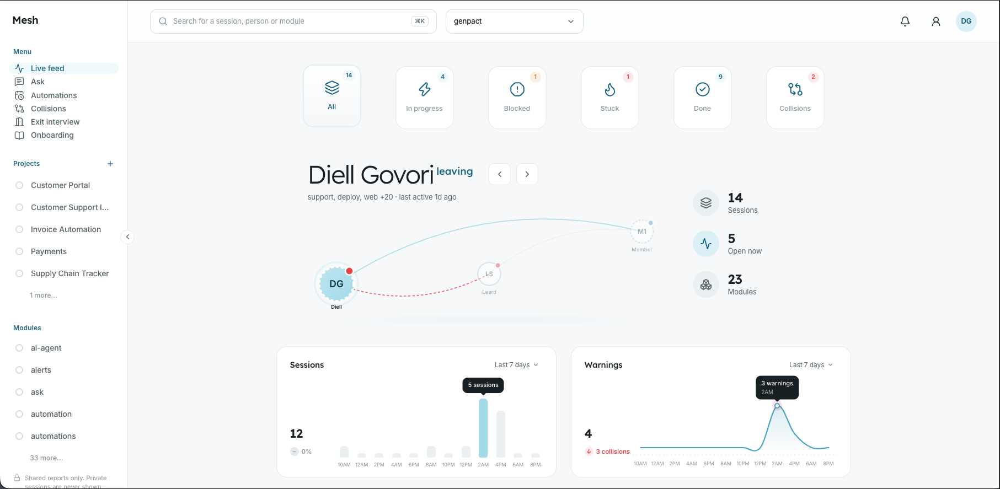

# Mesh

Mesh turns AI-agent work into live, queryable team knowledge.

When your AI agent (Claude Code, Codex, Cursor or Gemini CLI) finishes a task, Mesh records what it did, why, what failed and what is blocked. Your team sees it live, can ask questions about it, and gets warned when two people are about to clash or repeat a dead end.



## How it works

1. **Install the hook** on your computer. It connects Mesh to your agent.
2. **Work as usual.** Each time the agent finishes a response, it sends a short report to Mesh through the Mesh MCP server. Only shared reports are visible to the team. Private sessions are never shown.
3. **Everyone sees it.** The web app shows a live feed, lets you ask questions in plain language, and flags collisions between people and known dead ends.

```
your agent  --hook + MCP-->  Mesh server  -->  web app (live feed, ask, collisions)
```

## Get the MCP and hook

You need Node.js 20 or newer. Your team admin gives you the site address and your personal key.

1. Open your team's Mesh site and paste your key.
2. Open the profile menu and choose **Install the hook**.
3. Copy the command for your system and run it.

The command looks like this.

macOS and Linux:

```bash
curl -fsSL https://YOUR-SITE/install.sh | MESH_KEY=YOUR-KEY sh
```

Windows (PowerShell):

```powershell
$env:MESH_KEY="YOUR-KEY"; irm https://YOUR-SITE/install.ps1 | iex
```

Then restart your agent and work as usual. Your sessions show up in the web app within seconds.

To check the connection at any time: `node ~/.mesh/bin/cli.mjs status`

## What is in this repo

```
apps/server/        REST API, MCP server, database (Supabase), intelligence
apps/web/           web app: live feed, ask, collisions, exit interview
packages/cli/       the installer and the hook
packages/contract/  shared types used by everything else
docs/               deploy guide, database schema, server contract
```

## Run it yourself

Set up Supabase and Vercel with the step-by-step guide in [docs/deploy.md](docs/deploy.md).

For development (Node 20+ and pnpm):

```bash
pnpm install
pnpm build
pnpm test
```
